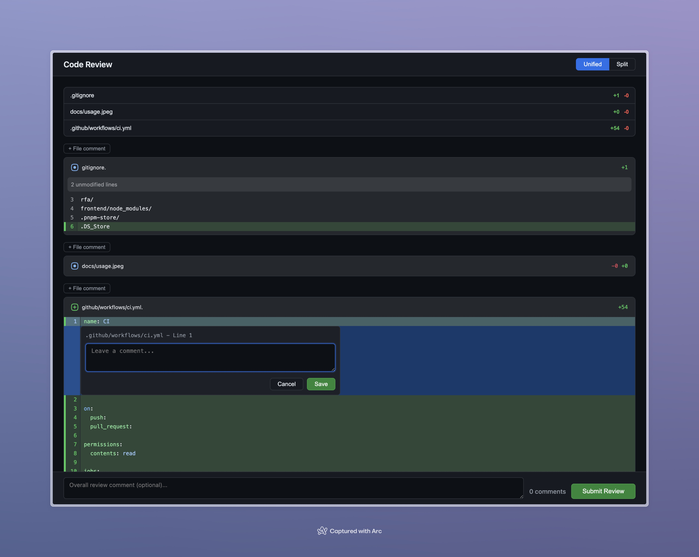

# review-for-agent

A local code review tool for giving structured, line-level feedback to AI coding agents — without opening a PR.

Review uncommitted changes in a GitHub-style diff view, leave inline comments, and export a Markdown file you can feed directly back to your AI agent.



## Why

After an AI coding agent edits files in your repo, there's no lightweight way to give it precise, line-level feedback. Opening a GitHub PR just to leave review comments on local changes is overkill. Copy-pasting file paths and line numbers into chat is error-prone and loses context.

**review-for-agent** gives you a familiar PR review UI that runs entirely on your machine and outputs a structured Markdown file the agent can consume.

## Features

- **GitHub-style diff view** — unified or split, powered by [@pierre/diffs](https://diffs.com/)
- **Inline comments** — click a line number to comment; shift-click to select a range
- **File-level comments** — feedback on an entire file, not tied to a specific line
- **Global review comment** — overall feedback at the top of the review
- **Structured export** — outputs both JSON and agent-friendly Markdown with diff context snippets
- **Clipboard integration** — copies `review my comments on these changes in @rfa/comments_xxxx.md` to your clipboard on submit, ready to paste into your agent
- **Local** — no GitHub, no PRs. Single binary runtime with embedded frontend bundle

## Install

### Binary releases

Download the latest binary for your platform from the [GitHub Releases](https://github.com/Waraq-Labs/review-for-agent/releases) page.

```sh
# macOS (Apple Silicon)
# This creates: dist/review-for-agent-darwin-arm64
unzip review-for-agent_darwin_arm64.zip
mv dist/review-for-agent-darwin-arm64 /usr/local/bin/review-for-agent

# Linux (x86_64)
tar -xzf review-for-agent_*_linux_amd64.tar.gz
mv review-for-agent /usr/local/bin/

# Linux (ARM64)
tar -xzf review-for-agent_*_linux_arm64.tar.gz
mv review-for-agent /usr/local/bin/
```

### From source

Requires [Go 1.23+](https://go.dev/dl/).

```sh
go install github.com/Waraq-Labs/review-for-agent@v0.4.0
```

### Build locally

```sh
git clone https://github.com/Waraq-Labs/review-for-agent.git
cd review-for-agent
make setup
make build
```

### Development

Requires [Go 1.23+](https://go.dev/dl/), Node.js, and pnpm.

```sh
# terminal 1
make dev-api

# terminal 2
make dev-web
```

`make dev-web` runs Vite and proxies `/api/*` to `http://localhost:4000`.

## Usage

Run from the root of any Git repo with uncommitted changes:

```
$ review-for-agent
Listening on localhost:4000
Opening http://localhost:4000/review
```

Your browser opens with a diff of all uncommitted changes. Leave comments, then click **Submit Review**.

```
Wrote rfa/comments_5ae2.json
Wrote rfa/comments_5ae2.md
```

The Markdown file path is copied to your clipboard as:

```
review my comments on these changes in @rfa/comments_5ae2.md
```

Paste that into your AI agent's chat to have it address your feedback.

### Flags

| Flag | Description |
|------|-------------|
| `--no-open` | Don't auto-open the browser (useful when re-running and refreshing an already open tab) |

### Reviewing changes

1. **Click a line number** to add a single-line comment
2. **Click a line, then shift-click another** to comment on a range
3. **Click "+ File comment"** in a file header for file-level feedback
4. **Type a global comment** in the textarea at the bottom
5. **Click "Submit Review"** to export

### Port selection

The server tries port 4000 first, then increments until it finds a free port.

### Ignore paths with `.rfaignore`

If there are paths you never want in local review diffs (for example generated frontend bundles), add a `.rfaignore` file at repo root.

Example:

```gitignore
frontend/build/
```

`review-for-agent` reads `.rfaignore` at startup and excludes matching paths when generating tracked and untracked diffs.
Use one pattern per line. Empty lines and lines beginning with `#` are ignored.

Lockfiles are always excluded by the server, even if they are not listed in `.rfaignore`:
- `package-lock.json`
- `pnpm-lock.yaml`

## Build Commands

| Command | Description |
|------|-------------|
| `make setup` | Install frontend dependencies (`pnpm install`) |
| `make dev-api` | Run Go API/server (`go run . --no-open`) |
| `make dev-web` | Run Vite dev server |
| `make build-frontend` | Build `frontend/build` bundle |
| `make build` | Build frontend then build Go binary |
| `make verify-frontend-build` | Rebuild frontend and fail if `frontend/build` differs from git state |

## Output

Comments are written to the `rfa/` directory (created if it doesn't exist).

### Markdown format

The Markdown file is designed to be consumed by AI agents. It includes a preamble explaining the file structure, then comments grouped by file with diff context snippets:

```markdown
# Code Review Comments

> **How to read this file:**
> This file contains review comments on uncommitted changes in this repo.
> Comments are grouped by file. Each comment includes a line or line range
> reference and a quoted diff context snippet showing the relevant code.
> File-level comments (not tied to a specific line) appear under a
> "(file-level)" heading. A global comment, if present, appears at the top
> before any file sections.

Overall, nice progress but a few things to address.

## src/api/handler.ts

### Line 42
> +  const result = await fetch(url);
Add error handling here — what happens if the fetch fails?

### Lines 78–85
> +  if (user.role === 'admin') {
> +    grantAll(user);
> +  }
This grants blanket permissions. Should we scope this to the specific resource?

## src/utils/parse.ts (file-level)
This file duplicates logic from src/core/parser.ts — consider consolidating.
```

### JSON format

The JSON file contains the raw structured data for programmatic use:

```json
{
  "globalComment": "Overall, nice progress but a few things to address.",
  "comments": [
    {
      "file": "src/api/handler.ts",
      "startLine": 42,
      "endLine": 42,
      "side": "right",
      "body": "Add error handling here — what happens if the fetch fails?"
    }
  ]
}
```

## Requirements

- Git
- A modern web browser

## License

MIT
